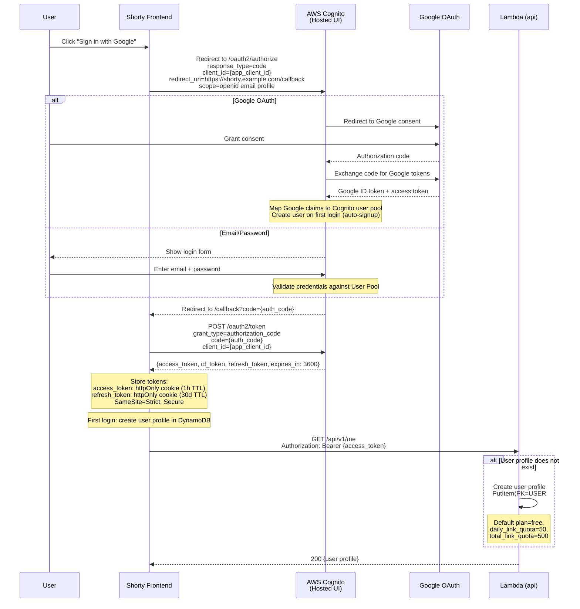
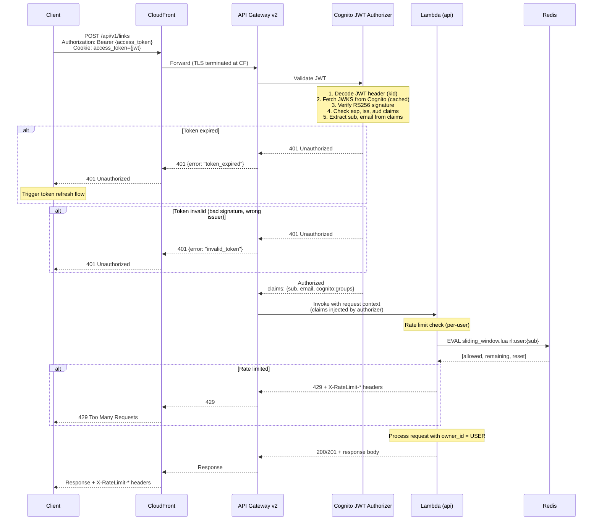
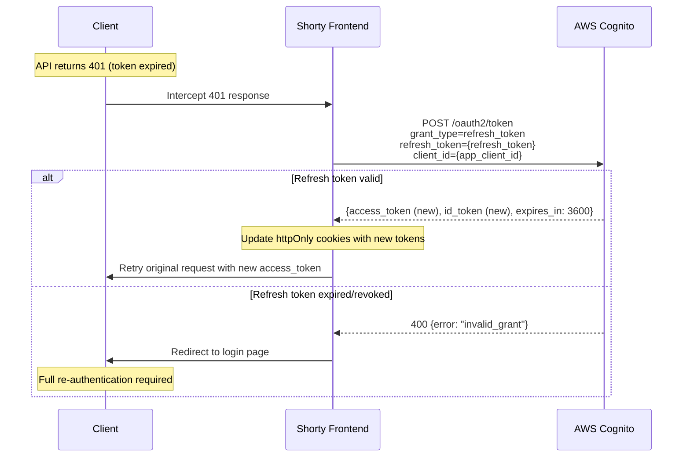
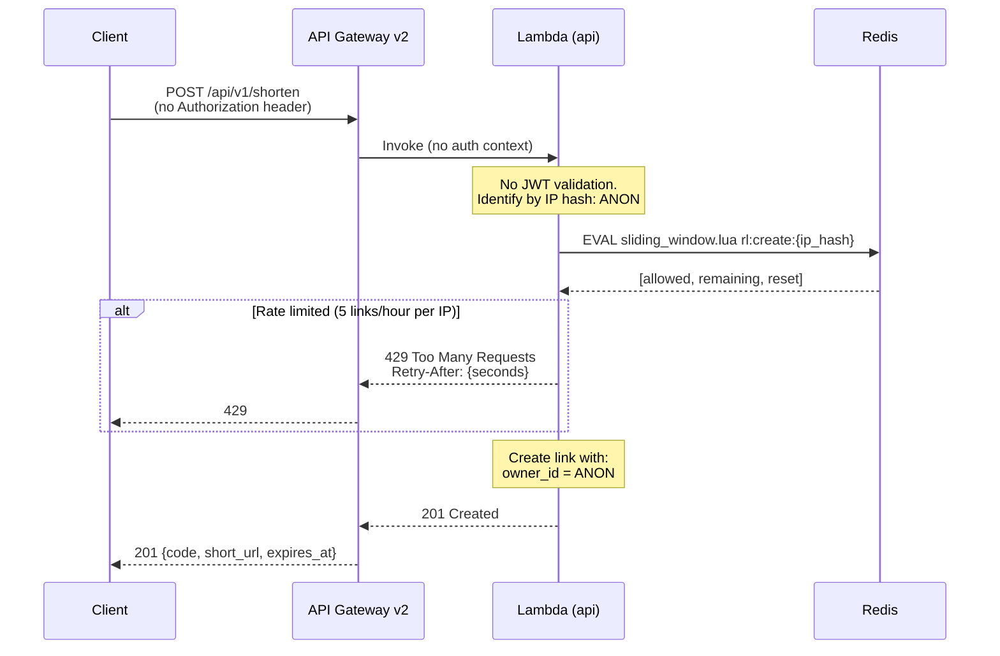

# Authentication Flow -- Cognito OAuth + JWT

Covers the full lifecycle: user login via Cognito Hosted UI, JWT issuance, API request authentication, and token refresh.

## 1. Initial Login (OAuth / Cognito Hosted UI)

## 2. Authenticated API Request

## 3. Token Refresh

## 4. Guest (Anonymous) Access

## JWT Claims Structure

| Claim | Source | Usage |
|-------|--------|-------|
| `sub` | Cognito | User ID (UUID). Becomes `USER#{sub}` in DynamoDB. |
| `email` | Cognito | User email. Stored in `users` table. |
| `cognito:groups` | Cognito | `free`, `pro`, `enterprise`. Maps to plan tier. |
| `iss` | Cognito | `https://cognito-idp.{region}.amazonaws.com/{user_pool_id}` |
| `aud` | Cognito | App client ID. Validated by authorizer. |
| `exp` | Cognito | Token expiry (1 hour from issuance). |
| `iat` | Cognito | Token issued-at timestamp. |

## Security Controls

| Control | Implementation |
|---------|----------------|
| Token storage | httpOnly + Secure + SameSite=Strict cookies |
| Token lifetime | Access: 1 hour. Refresh: 30 days. |
| JWKS caching | API Gateway caches Cognito JWKS (5 min TTL) |
| CSRF protection | SameSite=Strict cookie + CSRF token on forms |
| Token revocation | Cognito GlobalSignOut invalidates all refresh tokens |
| Brute-force protection | Cognito native: account lockout after 5 failed attempts |
