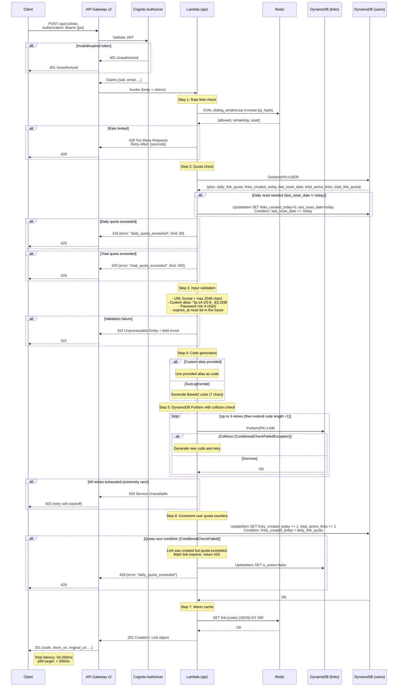

# Create Link Flow -- `POST /api/v1/links`

Authenticated link creation with code generation, collision handling, and cache warming.

## Collision Handling Strategy

| Attempt | Action |
|---------|--------|
| 1 | Generate 7-char Base62 code, PutItem with `attribute_not_exists(PK)` |
| 2 | Generate new 7-char code, retry PutItem |
| 3 | Generate new 7-char code, retry PutItem |
| 4 | Generate 8-char code (62^8 = 218 trillion combinations), retry PutItem |
| 5+ | Return 503 Service Unavailable |

With 7-char codes and <100M links, collision probability per attempt is ~0.003%. Three consecutive collisions have probability ~2.7 x 10^-14.

## Password Handling

If `password` is provided in the request body:
1. Hash with bcrypt (cost=12)
2. Store `password_hash` in the link record
3. The redirect Lambda checks for `password_hash` presence and returns a 403 + HTML form if set
