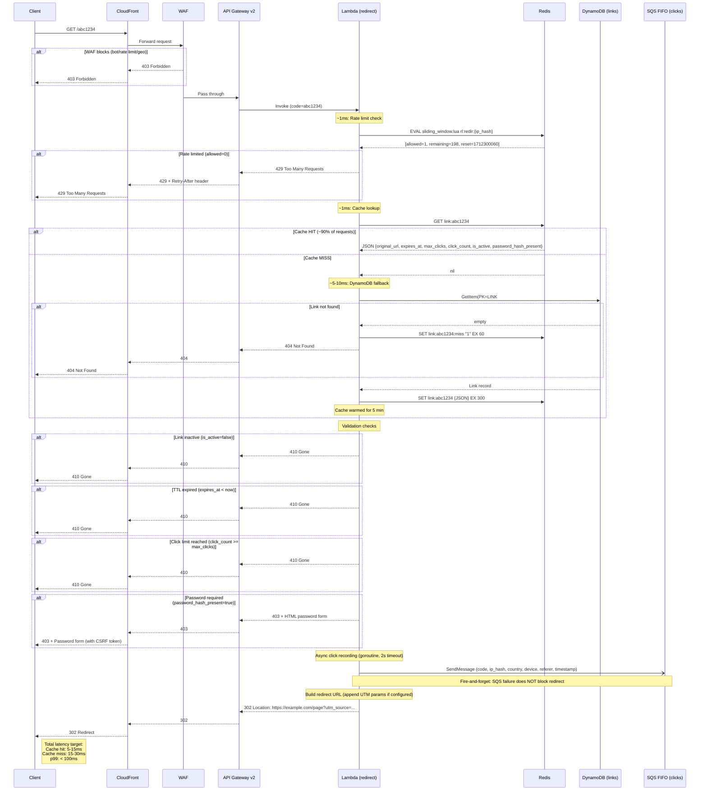

# Redirect Flow -- `GET /{code}`

The hot path. Target: p99 < 100ms.

## Timing Budget

| Step | Cache Hit | Cache Miss |
|------|-----------|------------|
| CloudFront + WAF | 1-3ms | 1-3ms |
| API Gateway routing | 1-2ms | 1-2ms |
| Lambda init (warm) | 0ms | 0ms |
| Rate limit (Redis) | 1ms | 1ms |
| Cache lookup (Redis) | 1ms | 1ms |
| DynamoDB GetItem | -- | 5-10ms |
| Cache write (Redis) | -- | 1ms |
| Validation logic | <1ms | <1ms |
| SQS SendMessage (async) | 0ms (non-blocking) | 0ms (non-blocking) |
| Response serialization | <1ms | <1ms |
| **Total** | **5-8ms** | **10-20ms** |

Cold start adds 200-400ms (mitigated by provisioned concurrency = 2).
